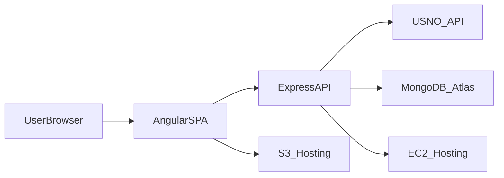

# Sky Observer Architecture

## Notes
- The Angular SPA handles UI, routing, and client-side interactions.
- Express centralizes all API calls and persistence logic.
- MongoDB Atlas stores user-created locations and lookup history.
